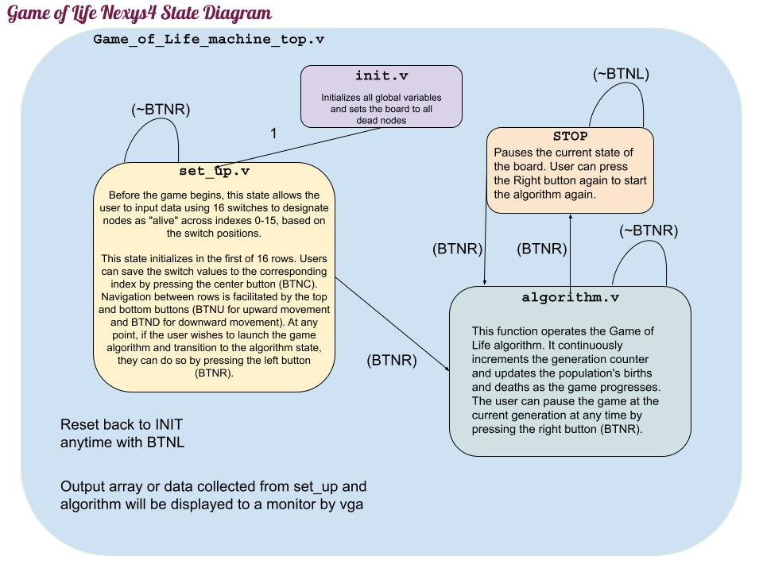

# Project Overview

This Verilog FPGA project is an implementation of "Conway's Game of Life." The simulation is intended to be ran on an ARTIX -7 NEXYS4 board. It outputs in 480p to a monitor through a VGA connector. The entire code base was designed in Verilog HDL. User input is taken by the 5 buttons and 16 switches fitted on the NEXYS4 board.

## **Conway's Game of Life**

Conway's Game of Life is a cellular automaton devised by mathematician John Horton Conway. 

It's a zero-player game, meaning its evolution is determined by its initial state, requiring no further input from human players. 

Our game takes place on a 16 by 16 grid of cells, which can be alive or dead. Cells evolve through generations based on simple rules regarding the number of live neighbors. This setup leads to complex behaviors and patterns. 

## **_Rules_ to Life**:

1. Any live cell with two or three live neighbors lives on to the next generation.

2. Any live cell with fewer than two live neighbors dies, as if by underpopulation.

3. Any live cell with more than three live neighbors dies, as if by overpopulation.

4. Any dead cell with exactly three live neighbors becomes a live cell, as if by reproduction.

# Asher Holtham's Nexys4 board Verilog Implementation Project Details

## When alive, this is what a cell in our game will look like:

- _Portrait photo of USC's Prof. Gandhi Puvvada_

- To scale for the 480p (Nexys4 VGA output) each cell is 28 by 28 pixels.

## EE354 Initial State Diagram Design:

